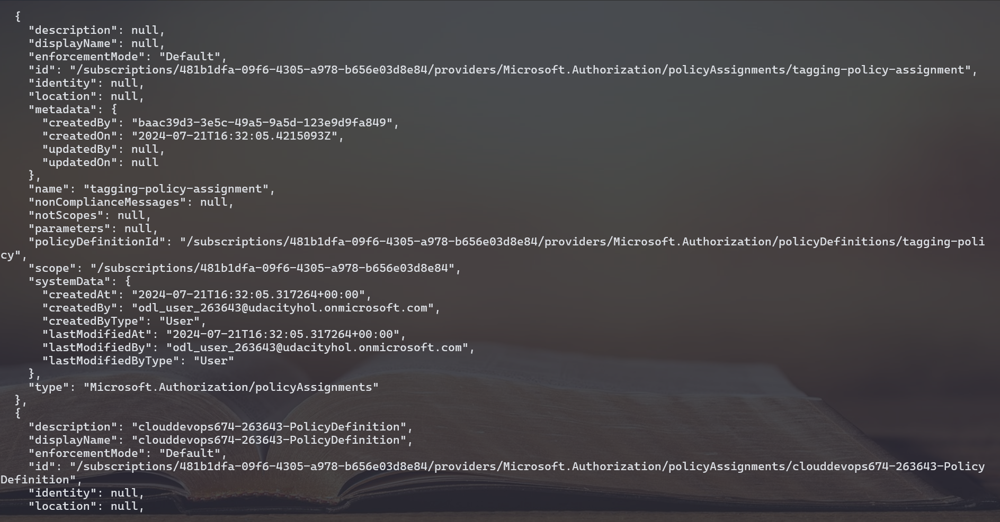
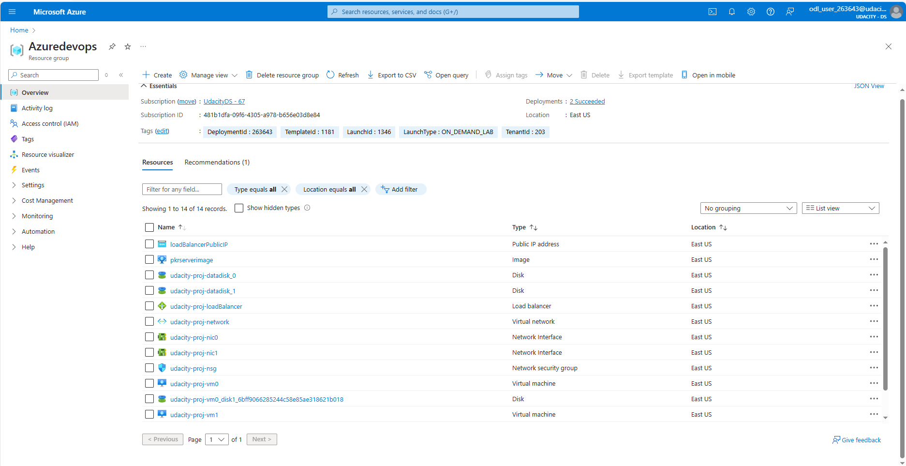

# Azure Infrastructure Operations Project: Deploying a scalable IaaS web server in Azure

### Introduction
For this project, you will write a Packer template and a Terraform template to deploy a customizable, scalable web server in Azure.

### Getting Started
1. Clone this repository
2. Create your infrastructure as code
3. Update this README to reflect how someone would use your code.

### Dependencies
1. Create an [Azure Account](https://portal.azure.com) 
2. Install the [Azure command line interface](https://docs.microsoft.com/en-us/cli/azure/install-azure-cli?view=azure-cli-latest)
3. Install [Packer](https://www.packer.io/downloads)
4. Install [Terraform](https://www.terraform.io/downloads.html)

### Instructions

The project is consist of the following main steps:
* Creating a Packer template
* Creating a Terraform template
* Deploying the infrastructure

### Setup Environment Variable
```
export ARM_SUBSCRIPTION_ID=<your-azure-account-subscription>
export RS_GROUP_NAME=<your-resource-group-name>
export ARM_CLIENT_ID=<your-application-id>
export ARM_CLIENT_SECRET=<your-client-secret>
export ARM_TENANT_ID=<your-tenant-id>
```

#### Deploy a Policy
Create a policy that ensures all indexed resources are tagged. This will help you with organization and tracking, and make it easier to log when things go wrong.
**Create the Policy Definition**<br>
```
cd policy
az policy definition create --name tagging-policy --display-name 'tags requirement policy' --description 'This policy enables you to deny the creation of resources that do not have tags' --rules policy.rules.json --mode indexed
```
**Create the Policy Assignment**<br>
az policy assignment create --policy tagging-policy --name tagging-policy-assignment --scope /subscriptions/$ARM_SUBSCRIPTION_ID



#### Create a Server Image
Packer is a tool that lets you create identical machine images for multiple platforms from a single source template.<br>
Run the bellow command to build new Image with Packer.
```
cd ..
packer build server.json
```

#### Terraform Template
Our Terraform template will allow you to reliably create, update, and destroy our infrastructure.
* main.tf: This file defines the Terraform configuration to create the infrastructure resources.
* vars.tf: This file defines variables used in the Terraform configuration.

#### Deploying Your Infrastructure
* Run the terraform init command: terraform init sets up the essential building blocks for your Terraform project. It prepares the environment, downloads necessary tools, and lays the groundwork for managing your infrastructure using Terraform configurations.

* Run the terraform import command: Import the resource group if you're already have a resource.
```
terraform import azurerm_resource_group.existing_rg /subscriptions/$ARM_SUBSCRIPTION_ID/resourceGroups/$RS_GROUP_NAME
```
* Run the terraform init command: It sets up the essential building blocks for your Terraform project. It prepares the environment, downloads necessary tools, and lays the groundwork for managing your infrastructure using Terraform configurations.
  ```
  terraform init
  ```
* Run the terraform plan command: It allows you to preview the changes Terraform will make to your infrastructure before actually applying them. We use the -out flag to save the plan file with the name solution.plan
  ```
  terraform plan -out solution.plan
  ```
  If you want to change the default value of any variable, you can use the command bellow.
  ```
  terraform plan -var username=admin -out solution.plan
  ```
* Run the terraform apply command: It executes the plan generated by terraform plan to create, update, or destroy infrastructure resources based on your Terraform configuration.
  ```
  terraform apply solution.plan
  ```

### Output
**Created resources**


### Destroy the resources
Once you're done, remember to destroy the resources.
```
terraform destroy
```
